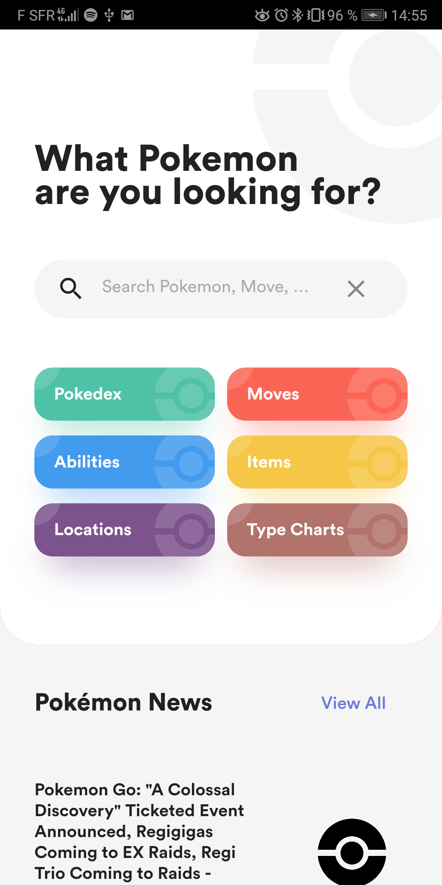
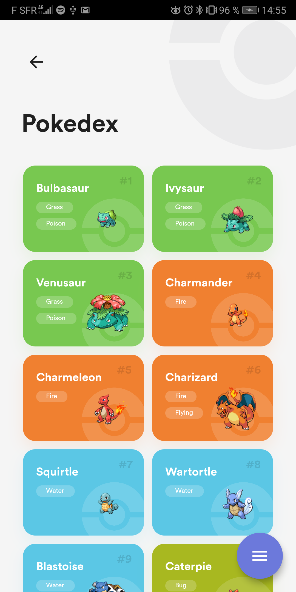
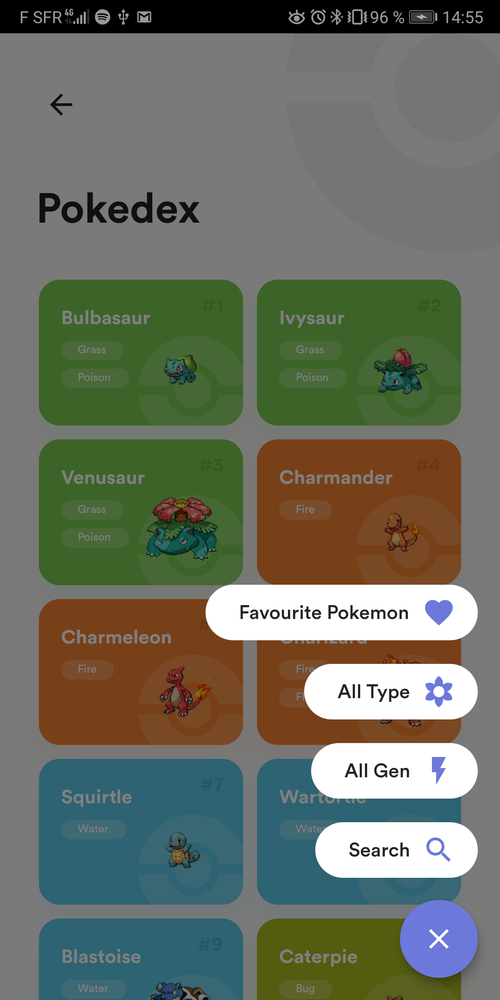
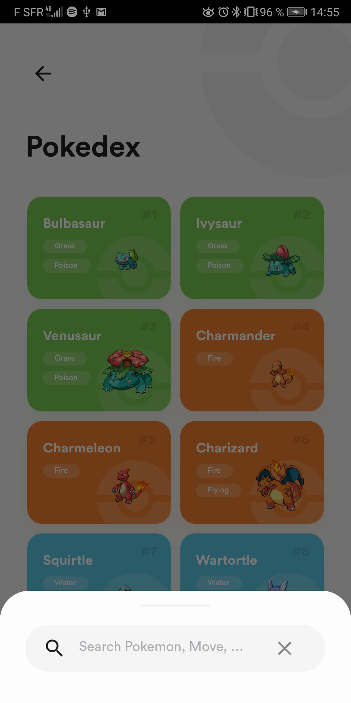
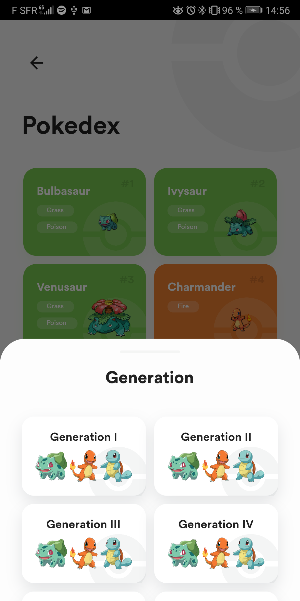
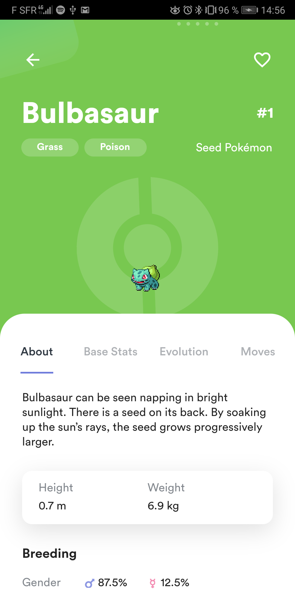
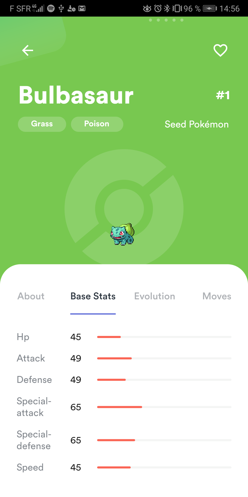
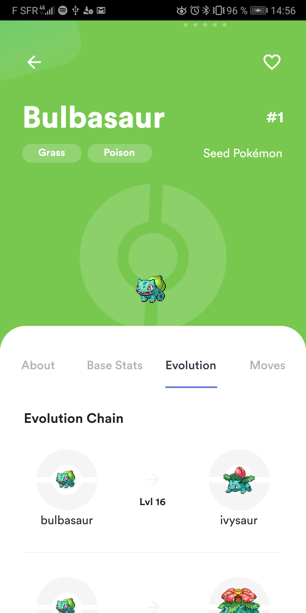
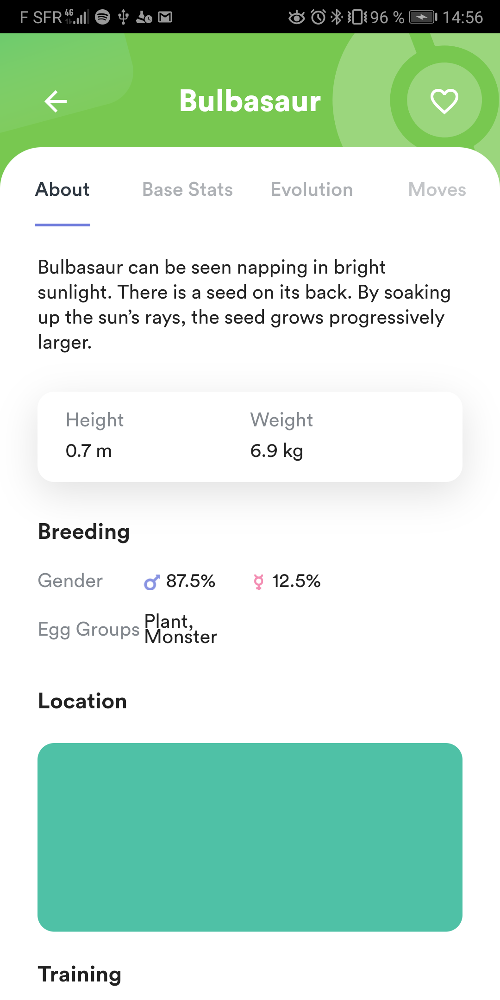

# Flutter Pokedex

Pokedex app built with Flutter

## Download

Soon!

## App preview

## Installation

- Add [Flutter](https://flutter.dev/docs/get-started/install) to your machine

- Open this project folder with Terminal/CMD and run `flutter packages get`

- Run `flutter run` to build and run the debug app on your emulator/phone

## Todos

- [x] Home
- [x] Home - Apply Sliver effect in home screen
- [x] Home - Real news pages
- [x] Pokedex
- [x] Pokedex - FAB
- [x] Pokedex - Add FAB animation
- [x] Pokedex - Add grid loading animation
- [ ] Pokedex - Working favourite pokemon
- [ ] Pokedex - Working type filter
- [ ] Pokedex - Working generation filter
- [x] Pokedex - Working searchbar
- [x] Pokemon Info
- [x] Pokemon Info - About
- [x] Pokemon Info - Base Stats
- [ ] Pokemon Info - Evolution
- [ ] Pokemon Info - Moves (no design)
- [x] Pokemon Info - Make tab area expandable
- [x] Pokemon Info - Add animations
- [x] Pokemon Info - Add more Pokemons
- [ ] PokeNews - Better design
- [ ] PokeNews - Pull to refresh

## Thanks

- [Saepul Nahwan](https://dribbble.com/saepulnahwan23) for his [Pokedex App design](https://dribbble.com/shots/6545819-Pokedex-App)
- [Flutter](https://flutter.dev) for the great cross platform framework
- [PokeAPI](https://pokeapi.co/) for the API containing all Pokemon informations
- [NewsAPI](https://newsapi.org/) for the API to display regular news about Pokemon
- [Scitbiz](https://github.com/scitbiz) for the work on the animation and the implementation of the design from his [Flutter Pokedex](https://github.com/scitbiz/flutter_pokedex)

## License

All the code available under the MIT + Apache 2.0. licenses. See [LICENSE](LICENSE).
